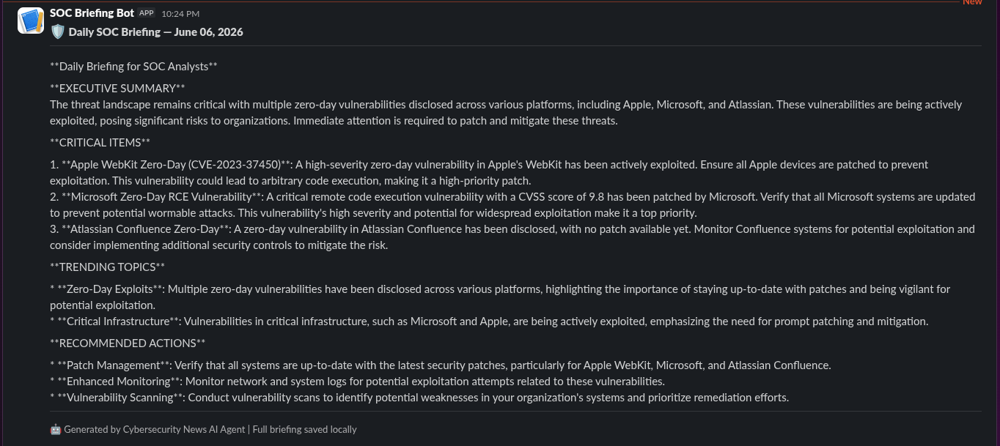
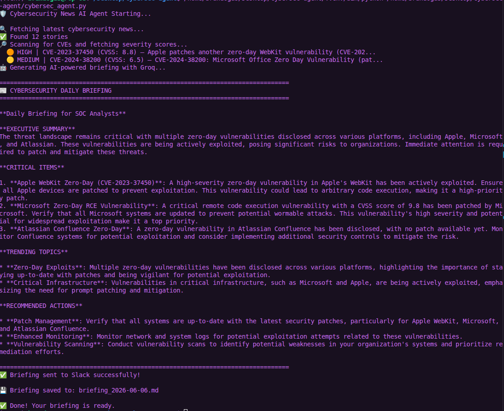
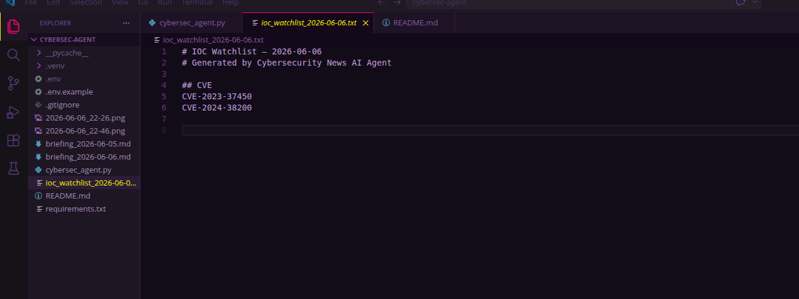

Cybersecurity News AI Agent

I got tired of spending 30 minutes every morning sifting through security blogs just to stay updated on threats. So I built this.

An AI-powered SOC briefing agent that automatically fetches cybersecurity news, scores CVE severity, and delivers a daily threat digest to Slack so you can focus on defending, not reading.

## Features

- **AI-Powered Analysis** using Groq
- **Multi-Source Aggregation**  (Hacker News, BleepingComputer, The Hacker News, Cybersecurity News, and Securelist RSS feeds)
- **Smart Prioritization** based on SOC-relevant keywords
- **CVE Detection from headlines** using regex extraction of CVE IDs
- **IOC Extraction** from story titles and URLs with domain, IP, hash, and CVE detection
- **NVD/CVSS Enrichment** to fetch severity scores and tag critical vulnerabilities
- **Automatic Archiving** of daily briefings and IOC watchlists
- **Structured Output** into `output/briefings` and `output/ioc_watchlists`
- **Scheduled Execution** via systemd or cron
- **Executive Summaries** tailored for security operations

## Screenshots







## Quick Start

### Prerequisites

- Pop!_OS 24.04 (or any Debian/Ubuntu-based Linux) - my setup
- Python 3.8+
- Internet connection
- Groq API key (optional but recommended)

### Installation

1. **Clone the repository:**
```bash
git clone https://github.com/Alchemy-Paul/Cybersecurity-News-AI-Agent.git
cd Cybersecurity-News-AI-Agent
```

2. **Configure your environment:**
```bash
cp .env.example .env
nano .env  # Add your Groq API key and Slack webhook URL
```

3. **Create and activate a virtual environment:**
```bash
python3 -m venv .venv
source .venv/bin/activate
```

4. **Install dependencies:**
```bash
pip install -r requirements.txt
```

5. **Test the agent:**
```bash
.venv/bin/python cybersec_agent.py
```

### Useful runtime options

```bash
.venv/bin/python cybersec_agent.py --max-stories 8
.venv/bin/python cybersec_agent.py --no-slack
.venv/bin/python cybersec_agent.py --no-save
.venv/bin/python cybersec_agent.py --print-only
.venv/bin/python cybersec_agent.py --no-ai
```

These options make it easier to run the agent locally for testing, preview output without writing files, or skip Slack delivery when you only want a local briefing.
